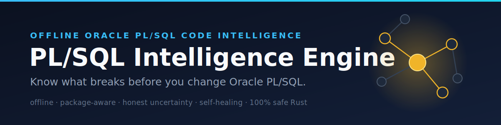

# PL/SQL Intelligence Engine

<div align="center">



Offline, package-aware Oracle PL/SQL code intelligence in Rust, with a
self-healing coverage flywheel.

</div>

<div align="center">

[](https://github.com/MuhDur/plsql-intelligence/actions/workflows/ci.yml)
[](https://github.com/MuhDur/plsql-intelligence/actions/workflows/usr.yml)
[](#license)
[](#design-commitments)
[](rust-toolchain.toml)

</div>

> Know what breaks before you change Oracle PL/SQL.

```sh
# Build the whole workspace and run every test
git clone https://github.com/MuhDur/plsql-intelligence
cd plsql-intelligence
cargo build --workspace && cargo test --workspace
```

---

## TL;DR

**The problem.** In a large Oracle estate, PL/SQL packages, views,
triggers and tables form a deep dependency web. Change one column type or
one package spec and you can silently invalidate hundreds of downstream
objects; you find out in a failed production recompile. Existing tools
each cover a slice (SQL deployment, lineage products, SAST scanners,
Oracle's own SQLcl MCP server), but none give offline, package-aware
PL/SQL semantics with explicit uncertainty reporting, dependency
reasoning, and recompile planning in one workflow.

**The solution.** A layered Rust workspace that parses PL/SQL with a real
ANTLR backend, builds a semantic IR with name resolution and a dependency
graph, and reports change impact. When the analyzer cannot be certain it
says so, as a typed `UnknownReason`, instead of reporting a false-clean
result. That honest-uncertainty exhaust feeds the **USR Loop**, which
turns recorded gaps into proven, privacy-clean parser and lowering
repairs so coverage compounds with use.

### Two MCP servers: `oraclemcp` and `plsql-mcp`

This repo ships the **full** PL/SQL Intelligence MCP server, **`plsql-mcp`** — live
Oracle DB tools **plus** offline PL/SQL intelligence (parse/analyze, dependency
graph, lineage, SAST) and guarded writes. Its engine-free core was extracted to a
standalone, published sibling, [**`oraclemcp`**](https://github.com/MuhDur/oraclemcp):

| | [`oraclemcp`](https://github.com/MuhDur/oraclemcp) | `plsql-mcp` (this repo) |
|---|---|---|
| Scope | Safe, read-only live **Oracle DB** access | The superset: DB access **+** PL/SQL **intelligence** + guarded writes |
| Build | Engine-free, lean, fast | Full pure-Rust ANTLR engine |
| Install | `cargo install oraclemcp` · `docker run -i ghcr.io/muhdur/oraclemcp` | `cargo install --path crates/plsql-mcp` · `docker run -i ghcr.io/muhdur/plsql-mcp` |
| MCP registry | `io.github.MuhDur/oraclemcp` | `io.github.MuhDur/plsql-mcp` |

Reach for `oraclemcp` when an agent just needs safe database access; use
`plsql-mcp` when you want deep PL/SQL code understanding (it includes everything
`oraclemcp` does).

> _Independent open-source project; not affiliated with Oracle. The Docker images
> bundle Oracle Instant Client under Oracle's Free Use Terms._

### Why use it?

| Capability | What it does |
|------------|--------------|
| **Offline-first** | Reads code and an Oracle catalog snapshot in place; no live database required for analysis, no telemetry by default |
| **Real parser backend** | `antlr4rust` (`plsql-parser-antlr`), pure Rust, no JVM, with a lossless token tape (`reconstruct(tape) == input`) |
| **Honest uncertainty** | Where analysis cannot be certain it emits a typed `UnknownReason`; the completeness report is never false-clean |
| **Dependency reasoning** | Semantic IR, name resolution, a privilege model, and a dependency graph cross-checkable against `ALL_DEPENDENCIES` |
| **USR Loop** | A self-healing flywheel: captured gaps become privacy-proven fixtures, candidate patches, and a 9-stage fail-closed conformance gate |
| **Verified accretion** | A monotone `coverage_index` with a CI tripwire makes "coverage compounds" a checked property, not a slogan |
| **Memory safety** | The whole workspace is `#![forbid(unsafe_code)]` |

### How it compares

| | Live DB needed | Package-aware PL/SQL semantics | Honest uncertainty | Offline analysis |
|---|:---:|:---:|:---:|:---:|
| SQL deployment tools (Liquibase, Flyway) | yes | no | no | no |
| Lineage / catalog products | varies | partial | no | varies |
| Generic SAST scanners | no | no | no | yes |
| Oracle SQLcl MCP server | yes | partial | no | no |
| **PL/SQL Intelligence Engine** | **no** | **yes** | **yes** | **yes** |

---

## Status

This is pre-1.0 software under active development. `plan.md` is the
authoritative specification; `docs/ARCHITECTURE.md` is the technical
architecture snapshot.

- The Cargo workspace ships 22 `plsql-*` engine and analysis crates plus 5
  tool binaries (`crates/`, `tools/`). The engine-free MCP server core (8
  `oraclemcp-*` crates: protocol, tool registry, the fail-closed SQL guard,
  audit sink, auth, telemetry, config, error envelope) was extracted to the
  standalone, published [`oraclemcp`](https://github.com/MuhDur/oraclemcp) repo;
  `plsql-mcp` now consumes them from crates.io. The one-way boundary
  (`oraclemcp-*` never imports a `plsql-*` engine crate) holds by construction
  and is enforced in the oraclemcp repo's CI. The foundation and
  product layers are implemented; live Oracle catalog extraction, the
  `verify`/CI-cascade path, and the live-DB MCP tool surface are
  feature-gated and exercised against a containerized Oracle 23ai
  (`live-xe` suites, `make demo-oracle-xe-ci`).
- The **USR Loop** (Layer 5) is implemented end to end: the
  `plsql-accretion` library, the `usr-loop` tool, the sha-pinned
  conformance gate, the monotone tripwire, and the re-runnable acceptance
  proof `scripts/usr_acceptance.sh`.
- The API can change before 1.0.
- `AGENTS.md` describes how automated agents work in this repo.

---

## Quick Example

```sh
# Build the workspace and run the full test suite
cargo build --workspace
cargo test --workspace

# Clippy with the project's deny-warning policy
cargo clippy --workspace --all-targets -- -D warnings

# Inspect the MCP server and its machine-readable contract
cargo run -p plsql-mcp -- info
cargo run -p plsql-mcp -- --robot-json capabilities

# Drive the USR Loop against an estate (read in place, nothing copied out)
cargo run -p usr-loop -- scan    /path/to/estate
cargo run -p usr-loop -- cluster /path/to/estate
cargo run -p usr-loop -- propose /path/to/estate --from-scan
cargo run -p usr-loop -- doctor

# The re-runnable Definition of Done for the USR Loop
scripts/usr_acceptance.sh
```

---

## The USR Loop (self-healing coverage flywheel)

Most analyzers discard parse errors and unresolved references as failure.
This one records them as typed, provenanced, minimizable, offline
artifacts, then repairs them. The full normative specification is
`docs/plans/2026-05-19-usr-loop-self-healing-coverage-flywheel.md`; the
repair-class policy and gate honesty manifest are in
`docs/decisions/D3-usr-repair-class-policy.md`.

```
 estate (read in place; no byte copied out)
   │  plsql-engine analyze → typed diagnostics + UnknownReason + provenance
   ▼
 [A] GAP CAPTURE      filter repairable diagnostic classes → GapRecord
   ▼                  (provenance only, never source bytes)
 [B] MINIMIZE +       smallest input that still triggers the same
     PRIVACY-PROVE     signature; every literal/identifier re-synthesized;
   ▼                  a redaction-delta manifest proves zero leak
 [C] CLUSTER/DEDUP    N occurrences → 1 GapCluster, K representative
   ▼                  fixtures
 [D] PROPOSE          one candidate diff, exactly one repair class
   ▼                  (g grammar / l lowering / d typed degradation)
 [E] CONFORMANCE GATE the 9-stage, fail-closed, sha-pinned bar
   ▼ pass                       ▼ fail
 [F] LAND + LEDGER     [F'] QUARANTINE-AS-OPEN-BEAD
   apply on branch,    file a provenanced bead naming the failing
   add the fixture +   stage; the gate is never weakened to admit it
   a pinned test,
   append one
   content-addressed
   ledger entry
   ▼
 [G] ACCRETION TRIPWIRE  the monotone coverage_index, CI-checked
```

### Invariants (the spec's spine; each is enforced, not aspirational)

| Invariant | What it guarantees |
|-----------|--------------------|
| **I-PRIVACY** | No customer byte leaves the estate. Every persisted artifact is a re-synthesized, structurally-equivalent minimal reproduction, proven leak-free per artifact (gate stage G8). A failed privacy proof aborts the run and persists nothing. |
| **I-NO-REGRESSION** | A patch lands only if proven behavior-preserving on the whole corpus: lossless round-trip, backend conformance, golden isomorphism, monotonic non-regression. Propose, prove, then land; never auto-merge unproven. |
| **I-NO-GAMING** | A coverage gain counts only with a commensurate, measured rise in extracted semantics for the targeted signature. Suppressing a diagnostic to "fix" a gap is auto-rejected at G7. |
| **I-DETERMINISM** | Same estate plus same engine commit yields byte-identical gap records, fixtures, signatures, and candidate set. No wall-clock, no RNG, no map-iteration order in any persisted artifact. |
| **I-PROVENANCE** | Every record, fixture, candidate, verdict, and landed patch is content-addressed and traces estate-run to diagnostic to fixture to diff to gate result. The ledger is append-only. |
| **I-ISOLATION** | Patches touch only the `.g4` grammar, `plsql-parser-antlr` codegen / lowering, or the typed-degradation classifier; never make a downstream crate depend on ANTLR types or break public contracts non-additively. |
| **I-MONOTONIC-VALUE** | The tracked `coverage_index` is monotone non-decreasing across releases. A release that lowers it fails CI. |

### The conformance gate

`scripts/usr_gate.sh` runs nine ordered stages, all must pass, fail-closed.
Any non-pass rejects the candidate and files it as a bead; the gate is
never weakened to admit a patch.

| Stage | Check |
|-------|-------|
| G1 | Builds: `plsql-parser-antlr --features antlr-codegen` and the workspace |
| G2 | Lossless round-trip over the full corpus and every prior MinFixture |
| G3 | Backend conformance (`plsql-parser/tests/conformance.rs`) |
| G4 | Golden isomorphism, or an explicitly listed and justified golden delta |
| G5 | Never-panic plus the fuzz targets, zero crashes |
| G6 | Monotonic non-regression (`scripts/estate_correctness.sh`, metrics at or above baseline) |
| G7 | Anti-gaming and honesty: diagnostics fall only with a commensurate extraction rise; posture not weakened |
| G8 | Privacy: redaction-delta verified over the candidate and every added fixture; a leak aborts the run |
| G9 | The added regression test is mutation-killed (fails if the patch is reverted) |

The gate script is content-pinned: `crates/plsql-accretion/gate.sha256`
holds the expected `sha256` and `plsql-accretion`'s gate runner aborts on a
mismatch. Changing the gate requires a deliberate, human-reviewed commit
plus a sha bump. `crates/plsql-accretion/tests/gate_selftest.rs` feeds the
gate an adversarial trio (a suppression-only patch, a privacy-leaking
fixture, a round-trip-breaking patch) and asserts each is rejected at its
named stage.

### `coverage_index` and the tripwire

```
coverage_index = extracted_semantics_ratio        (frozen public corpus
                                                    benchmark, never
                                                    private estate code)
               + distinct_resolved_gap_signatures  (signature classes the
                                                    loop has permanently
                                                    closed, from the
                                                    append-only ledger)
```

`scripts/accretion_tripwire.sh` (a required CI check) asserts
`coverage_index(HEAD) >= coverage_index(last release tag)`. A release that
lowers it fails. The `coverage_index`-over-time table lives in
`CHANGELOG.md`; the first release seeds the monotone floor
deterministically.

### Definition of Done

`scripts/usr_acceptance.sh` is the single re-runnable acceptance contract.
It is not a "looks built" check: it drives the loop to close a real,
currently-open gap in a private estate end to end and asserts every
invariant held (provenance, privacy-proven fixture, gate exit 0 or correct
quarantine, strict signature decrease, strict `extracted_semantics_ratio`
increase, preserved posture, ledger appended exactly once, mutation-killed
test, green adversarial gate self-test, byte-identical double run). When no
private estate is configured the script exits 0 with a loud
"estate-absent" banner, stating that the DoD is not proven in that
environment. CI runs the full acceptance proof nightly
(`.github/workflows/usr.yml`).

---

## Architecture

The workspace is layered (full detail in `plan.md` §5 and
`docs/ARCHITECTURE.md`). Downstream crates never depend on ANTLR-generated
types.

| Layer | Crates | What it owns |
|-------|--------|--------------|
| 0   | `plsql-core`, `plsql-output`, `plsql-render`, `plsql-store` | Diagnostics, completeness/uncertainty, output shapes, content-addressed cache |
| 1   | `plsql-parser`, `plsql-parser-antlr` | Backend-independent parser surface plus the ANTLR backend |
| 1.5 | `plsql-catalog` | Oracle catalog snapshot model plus live extraction |
| 2   | `plsql-ir`, `plsql-symbols`, `plsql-privileges`, `plsql-depgraph` | Semantic IR, name resolution, privilege model, dependency graph |
| 3   | `plsql-engine` | Orchestration: per-run `AnalysisRun`, `CompletenessReport` |
| 4   | `plsql-lineage`, `plsql-doc`, `plsql-bindgen`, `plsql-cicd`, `plsql-sast` | Lineage, docs, Rust bindings, change-set planning, static analysis |
| 5   | `plsql-mcp`, `plsql-accretion` | The unified MCP server plus the USR Loop library (no reverse deps) |
| MCP core (external) | `oraclemcp-core`, `oraclemcp-guard`, `oraclemcp-db`, `oraclemcp-audit`, `oraclemcp-auth`, `oraclemcp-telemetry`, `oraclemcp-config`, `oraclemcp-error` | Engine-free MCP server core: protocol/registry, the fail-closed SQL guard and operating-level state, the connection layer, the out-of-band audit sink, transport auth, telemetry, config, and the structured error envelope. `#![forbid(unsafe_code)]`; never imports a `plsql-*` engine crate (one-way boundary). **Extracted to the standalone [`oraclemcp`](https://github.com/MuhDur/oraclemcp) repo and consumed from crates.io**: `plsql-mcp` depends on the published `oraclemcp-core`/`-guard`/`-error` rather than in-workspace copies |

```
  PL/SQL source + Oracle catalog snapshot
              │
              ▼
   plsql-parser-antlr (lossless tape + AST)
              │
              ▼
   plsql-ir → plsql-symbols → plsql-depgraph
              │
              ▼
   plsql-engine: AnalysisRun + CompletenessReport
        │                    │
        ▼                    ▼
  product surfaces      typed UnknownReason exhaust
  (lineage / docs /           │
   bindings / cicd /          ▼
   sast)               plsql-accretion + usr-loop
                       (capture → fixture → gate → land)
```

Tool binaries: `tools/usr-loop` (the USR Loop orchestrator),
`tools/plan-lint` (structural lint of `plan.md`),
`tools/corpus-license-check`, `tools/corpus-bench`, `tools/corpus-grow`.

The MCP server (`plsql-mcp`) is a single binary built on the engine-free
`oraclemcp-*` core. It completes the MCP handshake, advertises the full
tool surface over `tools/list` — each tool carries a real argument
JSON-Schema and read-only / destructive annotations — and dispatches
`tools/call` end-to-end: static-analysis and change-impact tools execute
in-process; live-DB tools dispatch and degrade with a typed
`RuntimeStateRequired` response (naming the tool to call next) when no
active Oracle connection is configured. A zero-argument
`oracle_capabilities` tool reports the feature flags and surface so an
agent can orient before its first call, and failed calls return a
structured error envelope with a machine-readable class and a fuzzy
"did you mean" suggestion. A lockstep test enforces that every tool the
registry advertises has a dispatch arm.

---

## Installation

The workspace builds and tests with stable Rust (`rust-version = "1.85"`,
see `rust-toolchain.toml`).

### From source (recommended)

```sh
git clone https://github.com/MuhDur/plsql-intelligence
cd plsql-intelligence
cargo build --workspace --release
```

### Install a single binary

```sh
cargo install --path tools/usr-loop
cargo install --path crates/plsql-mcp
```

### Per-crate iteration

Per-crate builds keep cycles short during development:

```sh
cargo build -p plsql-catalog
cargo test  -p plsql-accretion
```

The MCP `live-db` feature pulls in the optional Oracle driver and requires
Instant Client at runtime; see `docs/integrations/live-db/` for
per-platform setup.

---

## Command Reference

### `usr-loop`

The USR Loop orchestrator. A global `--robot-json` flag emits a single-line
machine-readable envelope on every subcommand.

```sh
usr-loop scan    <estate>                  # [A] capture GapRecords
usr-loop cluster <estate>                  # [C] deduped GapClusters
usr-loop propose <estate> --from-scan      # [D] one candidate diff
usr-loop propose <estate> --cluster-id ID  # propose for a specific signature
usr-loop gate    <candidate-diff>          # run the sha-pinned §3 gate
usr-loop land    <candidate> --fixture F   # [F] gate, then land or quarantine
usr-loop ledger  <action>                  # inspect the append-only ledger
usr-loop doctor                            # crate/schema versions, deps
```

Exit codes for `gate`/`land`: `0` accepted/landed, `3` rejected/quarantined
(spec-correct, not a bug), `4` gate sha-pin abort, `9` I-PRIVACY abort
(nothing persisted).

### `plsql-mcp`

```sh
plsql-mcp info                       # server identity and tool tiers
plsql-mcp --robot-json capabilities  # machine-readable agent contract
plsql-mcp serve                      # stdio MCP loop
plsql-mcp serve --listen ADDR        # TCP MCP loop
```

### `plan-lint`

```sh
cargo run -p plan-lint --              # structural lint of plan.md
cargo run -p plan-lint -- --robot-json # machine-readable findings
cargo run -p plan-lint -- --doctor     # health summary
```

---

## Design Commitments

- Rust Cargo workspace, one crate per component.
- `doctor` subcommands and `--robot-json` output on every CLI surface, so
  agents read the machine contract instead of guessing.
- Explicit `UnknownReason` records whenever analysis cannot be certain; the
  completeness report is never false-clean.
- Parser backend isolation: downstream crates must not depend on
  ANTLR-generated types.
- The whole workspace is `#![forbid(unsafe_code)]`.
- No telemetry by default.

---

## Repository Workflow

1. Read `AGENTS.md` and `plan.md` first.
2. Treat `plan.md` as the source of truth for intended architecture and
   scope. If code and `plan.md` diverge, fix one or the other deliberately.
3. Track work in Beads only; `.beads/` is authoritative.
4. Never copy private material into this repository. The USR Loop and the
   correctness harness read a private estate in place, at the path given
   by the `PLSQL_PRIVATE_ESTATE` environment variable, and never persist
   its bytes.

---

## Layout

- `plan.md`: master specification
- `AGENTS.md`: repo operating rules
- `Cargo.toml`, `crates/`, `tools/`: Rust workspace
- `corpus/`: public and synthetic PL/SQL fixtures used by tests
- `docs/`: architecture snapshot, plans, decisions, integration guides
- `scripts/`: `usr_gate.sh`, `usr_acceptance.sh`, `accretion_tripwire.sh`,
  `estate_correctness.sh`
- `.beads/`: Beads issue-tracker state (authoritative)
- `CHANGELOG.md`: release-notes log plus the `coverage_index` table

---

## Troubleshooting

| Symptom | Fix |
|---------|-----|
| `usr-loop gate` exits 4 | Gate sha-pin mismatch. The gate script changed without a sha bump in `crates/plsql-accretion/gate.sha256`. This is intentional fail-closed behavior; re-pin only via a reviewed commit. |
| `usr-loop gate`/`land` exits 9 | An I-PRIVACY leak signal at G8. The run aborted and persisted nothing, by design. Inspect the offending fixture; do not weaken G8. |
| `usr_acceptance.sh` exits 0 with an "estate-absent" banner | No private estate is configured (`PLSQL_PRIVATE_ESTATE` unset or empty), so the DoD is not proven here. Run it with the variable pointing at a private estate, or rely on nightly CI. |
| `--features antlr-codegen` build fails | Codegen needs the nightly toolchain: `rustup run nightly cargo build -p plsql-parser-antlr --features antlr-codegen`. |
| Empty dependency graph on a real estate | Expected for the dialect tail the parser cannot yet reach; those are recorded as typed `UnknownReason` and are exactly the USR Loop's repair input, not a silent failure. |

---

## Limitations

- Pre-1.0: the API can move at any time before 1.0.
- Live-DB MCP tools dispatch over `tools/call` but require an active
  Oracle connection to execute; without one they return a typed
  `RuntimeStateRequired` response naming the missing runtime state, by
  design — agents can plan a session against the full advertised
  surface without an Oracle being attached.
- The USR Loop proposer does not auto-merge. It produces proven
  candidates; the proof is automatic and complete, the landing decision is
  gated by that proof and the repo's normal review (per `D3`).
- Genuinely-ambiguous Oracle dialect forms are not resolved by guessing.
  They become honest typed `UnknownReason` (repair-class `d`): coverage of
  honesty, never of fabrication.
- Accretion compounds on signature classes, not raw counts. A long tail of
  singleton estate quirks may stay open; that is reported, not masked.
- Class-`g` grammar patches are real grammar work, gated like everything
  else: slower, but sound.
- Referential-integrity subsetting is routed to a separate future plan, not
  the first release.

---

## FAQ

**Does analysis require a live Oracle database?** No. Analysis is offline
against source plus an optional catalog snapshot. Live catalog extraction
and the live-DB MCP surface are available but feature-gated.

**Is the parser real, or a heuristic scanner?** Real. The engine parses
through `antlr4rust` in `plsql-parser-antlr` with a lossless token tape;
the decision and evidence are in `docs/decisions/D2-backend-final.md`.

**What happens to constructs the parser cannot handle?** They are recorded
as typed `UnknownReason` with provenance. The completeness report reflects
that honestly instead of reporting a false-clean result.

**Has the USR Loop closed N gaps on a real estate?** That claim is not
made here as a settled marketing fact. The mechanism is implemented and
the proof is the re-runnable `scripts/usr_acceptance.sh` plus nightly CI.
This README documents how to run it, not an unverifiable boast.

**Can I weaken the gate to land a patch faster?** No. The gate is
sha-pinned and fail-closed; a mismatch aborts. Changing it requires a
reviewed commit and a deliberate sha bump.

**Is any code `unsafe`?** No. The whole workspace is
`#![forbid(unsafe_code)]`.

---

## License

Dual-licensed under either of:

- Apache License, Version 2.0 ([LICENSE-APACHE](LICENSE-APACHE))
- MIT license ([LICENSE-MIT](LICENSE-MIT))

at your option. The vendored ANTLR PL/SQL grammar under
`crates/plsql-parser-antlr/grammars/` is Apache-2.0, from
`antlr/grammars-v4`; attribution is preserved in
`crates/plsql-parser-antlr/LICENSE-GRAMMARS.md`.

Unless you explicitly state otherwise, any contribution intentionally
submitted for inclusion in the work by you, as defined in the Apache-2.0
license, shall be dual-licensed as above, without any additional terms or
conditions.

---

## About Contributions

*About Contributions:* Please don't take this the wrong way, but I do not accept outside contributions for any of my projects. I simply don't have the mental bandwidth to review anything, and it's my name on the thing, so I'm responsible for any problems it causes; thus, the risk-reward is highly asymmetric from my perspective. I'd also have to worry about other "stakeholders," which seems unwise for tools I mostly make for myself for free. Feel free to submit issues, and even PRs if you want to illustrate a proposed fix, but know I won't merge them directly. Instead, I'll have Claude or Codex review submissions via `gh` and independently decide whether and how to address them. Bug reports in particular are welcome. Sorry if this offends, but I want to avoid wasted time and hurt feelings. I understand this isn't in sync with the prevailing open-source ethos that seeks community contributions, but it's the only way I can move at this velocity and keep my sanity.


---

### Work with me

I help enterprises with the hard parts — databases at scale, systems modernization, and AI in production, vendor-neutral (cloud or self-hosted). Building something hard in Oracle / Rust / AI? Reach out.

→ **[durakovic.ai](https://durakovic.ai)** · hello@durakovic.ai
