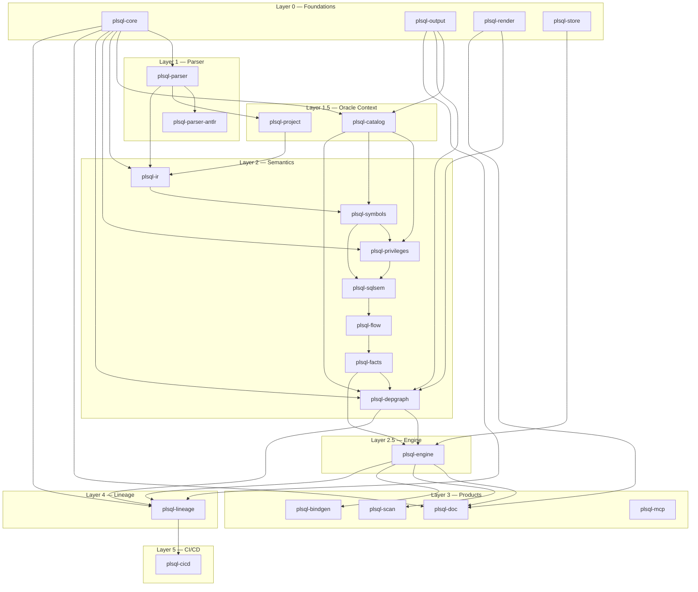

# Architecture — plsql-intelligence

> ⚠️ **SUPERSEDED — read [`docs/ARCHITECTURE.md`](ARCHITECTURE.md) instead.**
> That uppercase file is the canonical, current technical architecture
> report (the one `README.md` links to) and carries a dated
> *Session delta* with the post-2026-05-15 state. This lowercase file is
> the older 2026-05-13 layered overview, kept only for its Layer 0→5
> dependency-ordering diagram and historical context; it is **not**
> maintained. On a case-insensitive filesystem these two paths collide —
> always treat the uppercase `ARCHITECTURE.md` as authoritative.

> **Spec authority:** `plan.md` governs. If this document and the plan diverge, fix one deliberately.
> **Last updated:** 2026-05-13 against workspace state at that date.

---

## 1. Architectural Overview

The engine is organized as **six architectural layers** with strict dependency ordering. Lower layers are dependencies of higher layers; Layer N may only depend on Layers 0..N-1.

```
Layer 5 — CI/CD Recompilation Cascade (plsql-cicd)
Layer 4 — Lineage Engine (plsql-lineage)
Layer 3 — Product Surfaces (plsql-scan, plsql-doc, plsql-bindgen, plsql-mcp)
Layer 2.5 — Analysis Orchestration (plsql-engine)
Layer 2 — Semantic IR & Symbol Resolution
           plsql-ir → plsql-symbols → plsql-privileges → plsql-sqlsem
           → plsql-flow → plsql-facts → plsql-depgraph
Layer 1.5 — Oracle Context
           plsql-project (file discovery, SQL*Plus splitting)
           plsql-catalog (offline-first DB metadata snapshot)
Layer 1 — Parser Core (plsql-parser, plsql-parser-antlr)
Layer 0 — Foundations
           plsql-core, plsql-output, plsql-render, plsql-store
```

**Maximum parallelism** after Layer 1 completes: 2 swarms on Layer 1.5 (project + catalog), then up to 6 on Layer 2's partial order, then 3 on Layer 3 surfaces, and 1 each on Layer 4 and Layer 5.

The single public release ships everything together. There are no intermediate alphas — internal convergence gates (parser, catalog, semantic, graph, product-surface, GA) control quality without being customer-facing milestones.

---

## 2. Crate Inventory

### Layer 0 — Foundations

**`plsql-core`** (885 lines) — Shared types consumed by every other crate. Defines `FileId`, `Span`, `Position`, `Severity`, `Diagnostic`, `UnknownReason` (12 variants covering every blind spot: dynamic SQL, wrapped code, missing catalog, DB-link, conditional compilation, runtime grants, etc.), `Confidence` (level + explanation), `Evidence` (code, summary, spans, attributes), `AnalysisProfile` (Oracle version, feature policy, CC flags, NLS, roles), `CompletenessReport`, and the `SymbolInterner` that backs all interned identifier wrappers (`SchemaName`, `ObjectName`, `UserName`, `RoleName`, etc.).

**`plsql-output`** (479 lines) — Versioned output envelopes for every `--robot-json` surface. `RobotJsonEnvelope<T>` wraps any serializable payload with a schema ID + version. `DiagnosticEnvelope`, `EvidenceEnvelope`, `RedactionPolicy`. Also defines `OrphanCandidate`, `OrphanConfidenceTier`, and `OrphanCandidatesReport` for the §13.8 orphan-candidates report.

**`plsql-render`** (295 lines) — Low-level rendering helpers shared across product surfaces. `html::shell(title, body)`, `markdown::table(headers, rows)`, `svg::node_graph(graph)` over a generic `GraphView` trait. Component crates own their domain-specific output (SARIF, doc HTML, GraphML) and use these helpers for the boring parts.

**`plsql-store`** (388 lines) — SQLite-backed content-addressed cache. Two access modes: immutable artifact mode (CI/reproducibility) and local daemon mode (warm cache for developer workflows). Source files remain normal files; only derived artifacts are content-addressed by hash.

### Layer 1 — Parser Core

**`plsql-parser`** (272 lines) — Parser frontend crate. Defines `ParseBackend` trait, `ParseResult` (CST + AST + token tape + diagnostics), the lossless token tape contract, and the typed AST node hierarchy. Backend choice is a build/runtime option; generated parser internals are private to the backend crate.

**`plsql-parser-antlr`** (59 lines) — First backend candidate using `antlr4rust` + ANTLR grammars-v4 PL/SQL grammar (BSD-3-Clause). Implements `ParseBackend`. Generated types are strictly private.

### Layer 1.5 — Oracle Context

**`plsql-catalog`** (4245 lines) — Offline-first Oracle dictionary metadata model. `CatalogSnapshot` is the top-level container carrying per-schema `SchemaCatalog` (objects, synonyms, grants, indexes, constraints, triggers, dependencies, PL/Scope). Three ingestion paths: `load_snapshot_from_json()`, `load_snapshot_from_connection()` via `OracleConnection` trait, `load_from_dbms_metadata_dir()` for DDL file directories. Includes `SyntheticCatalogBuilder` for test fixtures and the canonical `billing_schema()` demo estate. PL/Scope integration provides `PlScopeSnapshot` with `CompilerIdentifier`, `CompilerReference`, and differential testing against Oracle's own compiler output. Per-component doc: `docs/components/catalog.md`.

**`plsql-project`** — Repository discovery, SQL\*Plus statement splitting, `@`/`@@` includes, package spec/body pairing, conditional-compilation preprocessing, wrapped-source detection. Not yet implemented in workspace.

### Layer 2 — Semantic IR & Symbol Resolution

**`plsql-privileges`** (15 lines, newly scaffolded) — Authorization model combining source annotations (`AUTHID`, `ACCESSIBLE BY`) with catalog-derived grants and roles. `PrivilegeModel` aggregates resolved grants, ACCESSIBLE BY entries, cross-schema write surface, synonym-mediated paths, and runtime ambiguities. `resolve_privileges()` builds the model from a `CatalogSnapshot` + `PrivilegeConfig`. `UnknownReason::RuntimeGrantOrRole` for ambiguous role grants.

**`plsql-depgraph`** (2404 lines) — Dependency graph builder. `DepGraph` carries `HashMap<NodeId, Node>` + `Vec<Edge>` + provenance + evidence maps. Three-layer node identity: `LogicalObjectId` + `ObjectRevisionId` + optional `PersistentObjectId`. Edge kinds: Calls, Reads, Writes, ReadsColumn, WritesColumn, DerivesColumn, TriggersOn, Constrains, OpaqueDynamic, DbLink, References. `ResolutionStrategy` enum (13 strategies). CLI: `query` (neighbors, reverse-neighbors, path, cycle-detect), `doctor` (graph stats, low-confidence inventory), `explain` (full provenance + evidence per edge/node/path). GraphML, GraphViz `.dot`, robot-JSON serializers. Trigger and constraint edge extraction from catalog snapshots.

### Layer 2.5 — Analysis Orchestration

**`plsql-engine`** (171 lines, skeleton only) — Canonical pipeline boundary. Wires project → parse → catalog → IR → symbols → privileges → sqlsem → flow → facts → depgraph into one reproducible `AnalysisRun`. Implementation belongs to Layer 2.5; skeleton exists for consumer crates to compile against.

### Layer 3 — Product Surfaces

**`plsql-doc`** (526 lines) — Documentation generator types and lexers. `DocSet`, `ObjectDoc`, `DocComment` with `DocSpan` byte-offset tracking. `extract_doc_comments()` lexes Javadoc-style `/** */` blocks and legacy `--` preceding-line comment runs. `parse_doc_tags()` splits raw text into tagged blocks (`@description`, `@param`, `@returns`, `@throws`, `@example`, `@deprecated`, `@see`, `@since`, `@author`).

**`plsql-bindgen`** (151 lines) — Type-safe bindings generator. Skeleton with `OracleExecutor` trait and `BindingPlan` IR stub.

**`plsql-lineage`** (984 lines) — Lineage engine: cross-object impact + change classification. `LineageQuery`/`LineageResult` with `LineageEdge` and `UnknownEdge`. `SemanticChangeSet` with 10 `ChangeRecord` variants (Created, Dropped, Signature, Body, Privilege, Synonym, Column, Type, Grant, Ddl). `dependencies()` does BFS reverse traversal on `DepGraph` incoming edges. `classify_git_diff()` and `classify_dir_diff()` emit `SemanticChangeSet` from git diffs or directory comparisons.

### Not yet created

| Crate | Layer | Purpose |
|-------|-------|---------|
| `plsql-ir` | 2 | Typed semantic IR (scopes, declarations, references) |
| `plsql-symbols` | 2 | Name resolution with full overload resolution |
| `plsql-sqlsem` | 2 | Embedded-SQL semantic model (table/column use, projections) |
| `plsql-flow` | 2 | Value flow, taint, constants, value sets |
| `plsql-facts` | 2 | Normalized fact store for all product surfaces |
| `plsql-scan` | 3 | SAST engine (SARIF, rule pack) |
| `plsql-mcp` | 3 | MCP server for AI agents (static-analysis + change-impact tools) |
| `plsql-cicd` | 5 | Recompilation cascade, predict/plan/gate |

---

## 3. Dependency Graph



*Note: This shows primary data-flow edges. `plsql-core` and `plsql-output` are transitive dependencies of nearly every crate but only direct edges are drawn.*

---

## 4. Trust Block & UnknownReason Design

### The Trust Block

Every customer-visible report leads with a compact completeness profile:

```
Trust block
- Files parsed cleanly: 94%
- Recovered parses: 5%, Skipped tokens: <1%
- Catalog available: yes (snapshot 2026-05-08T12:00:00Z)
- Wrapped units: 3 (UnknownReason::WrappedSource)
- Dynamic SQL sites: 41 total, 7 opaque, 34 with evidence
- Exact column lineage: 72%
```

This is not an internal detail — it is the brand promise. The tool wins by being more honest and more actionable than alternatives. Every report answers four questions:

1. **What do we know?**
2. **Why do we believe it?** (provenance — file, line, parse rule, resolution strategy)
3. **What do we not know?** (named `UnknownReason`)
4. **What would improve confidence?**

### UnknownReason Variants

`plsql-core::UnknownReason` is a closed enum with 12 variants. No uncertainty is silently dropped (R13):

| Variant | Meaning |
|---------|---------|
| `DynamicSqlOpaque` | EXECUTE IMMEDIATE / DBMS_SQL with unresolvable string |
| `DbLinkRemoteObject` | Object on remote DB link |
| `WrappedSource` | Oracle wrapped (obfuscated) source |
| `MissingCatalogObject` | Name references object not in snapshot |
| `MissingPackageBody` | Spec exists but body was not provided |
| `ConditionalCompilationBranch` | Object compiled under different CC flags |
| `EditionedObject` | Object participates in edition-based redefinition |
| `InvokerRightsRuntimeResolution` | AUTHID CURRENT_USER dispatch is ambiguous |
| `RuntimeGrantOrRole` | Authorization depends on runtime role state |
| `UnsupportedDialectFeature` | Oracle version feature not yet supported |
| `ParserRecoveryRegion` | Parser recovered from syntax error in this region |

Every downstream crate that encounters one of these conditions records it in its output — dependency edges, privilege model, symbol table, fact store. The `CompletenessReport` aggregates counts for the Trust Block.

### Confidence Model

`Confidence` carries a level (High/Medium/Low/Opaque) and an optional explanation string. Customer-facing tools surface confidence as bands by default; raw values available via `--robot-json`. Reports MUST NOT compress completeness into a single scalar score (§1.5).

---

## 5. R-Rules Summary

Key architectural rules from `plan.md` §4:

**R10 — Robot JSON.** Every CLI ships `--robot-json` that emits machine-parseable output using `plsql-output` versioned envelopes. No component invents its own envelope shape (R5).

**R11 — Doctor.** Every component ships a `doctor` subcommand per the `world-class-doctor-mode-for-cli-tools` skill. Self-healing CLI tools; reduced support cost.

**R13 — No Silent Drops.** No uncertainty is silently dropped. Dynamic SQL, wrapped code, missing catalog, DB-links, parser recovery, conditional compilation, edition-based redefinition, invoker-rights ambiguity — all become explicit `UnknownReason` records with provenance and confidence. This is the credibility feature, not a defensive hedge.

**R17 — No Telemetry.** No telemetry by default. Customers may opt in; opt-in payload is documented and minimal. Trust posture for regulated buyers.

**R20 — Parser Backend Isolation.** All parser backends implement `ParseBackend`. Backend choice is a build/runtime option. Generated parser internals (ANTLR parse-tree types, rule names) are private to the backend crate. The public surface is our lossless CST/token tape plus typed AST. Architectural insurance against the single biggest technical risk.

**Other notable rules:**

- **R1:** Rust for all parser-derived components. Single-binary distribution.
- **R3:** Single Cargo workspace, one crate per component.
- **R4:** Every component exposes a library API, a CLI binary, and a JSON I/O surface.
- **R8:** `miette` for human diagnostics, `thiserror` for library errors.
- **R9:** `tracing` with structured fields. Spans on every public API call.
- **R12:** Provenance metadata on every dependency-graph edge.
- **R14:** `plsql-store` SQLite cache for large workflows.
- **R18:** `rustfmt` default + `cargo clippy -- -D warnings`. No exceptions.
- **R19:** 80% line coverage on parser core, 70% on every other component.

---

## 6. Cross-References

### Implemented component docs

| Component | Doc path | Status |
|-----------|----------|--------|
| Catalog snapshot | `docs/components/catalog.md` | ✅ Complete (455 lines) |
| Parser design | `docs/components/parser.md` | ✅ Exists |

### Decision records

| Decision | Doc path | Status |
|----------|----------|--------|
| D1: Parser backend spike | `docs/decisions/D1-parser-backend-spike.md` | ✅ Exists |

### Plan sections by component

| Component | Plan section | Bead prefix |
|-----------|-------------|-------------|
| Parser core | §7 | `PLSQL-PARSE-*` |
| Catalog snapshot | §8 | `PLSQL-CAT-*` |
| Semantic IR | §9.2.1 | `PLSQL-IR-*` |
| Symbol resolver | §9.2.2 | `PLSQL-SYM-*` |
| Privileges | §9.2.4 | `PLSQL-PRIV-*` |
| SQL semantics | §9.2.7 | `PLSQL-SQLSEM-*` |
| Value flow | §9.2.6 | `PLSQL-FLOW-*` |
| Fact store | §9.2.5 | `PLSQL-FACT-*` |
| Dependency graph | §10 | `PLSQL-DEP-*` |
| Analysis engine | §10A | `PLSQL-ENG-*` |
| Doc generator | §11 | `PLSQL-DOC-*` |
| SAST | §12 | `PLSQL-SAST-*` |
| Bindings | §13 | `PLSQL-BG-*` |
| MCP adapter | §13A | `PLSQL-MCP-*` |
| Lineage | §14 | `PLSQL-LIN-*` |
| CI/CD cascade | §15 | `PLSQL-CICD-*` |
| Orphan candidates | §13.8 | `PLSQL-LIN-*` (orphan subset) |

### To be authored

| Component | Planned doc path |
|-----------|-----------------|
| Parser core | `docs/components/parser-design.md` (expand existing) |
| Symbol resolver | `docs/components/symbols.md` |
| Dependency graph | `docs/components/depgraph.md` |
| Lineage engine | `docs/components/lineage.md` |
| SAST rules | `docs/components/sast-rules.md` |
| MCP adapter | `docs/components/mcp.md` |
| Trust Block UX | `docs/trust-block.md` |
